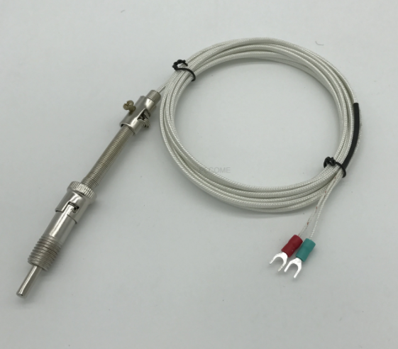
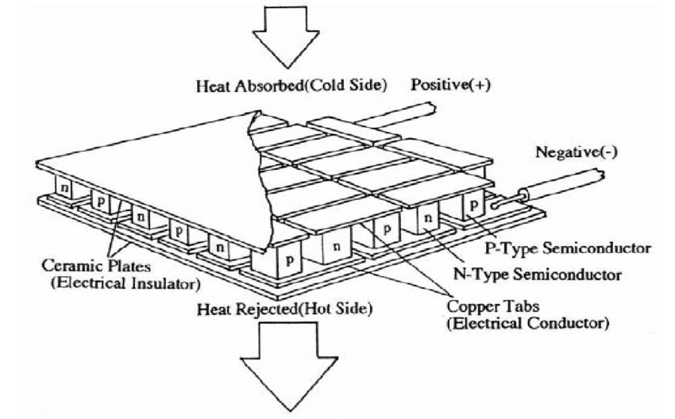
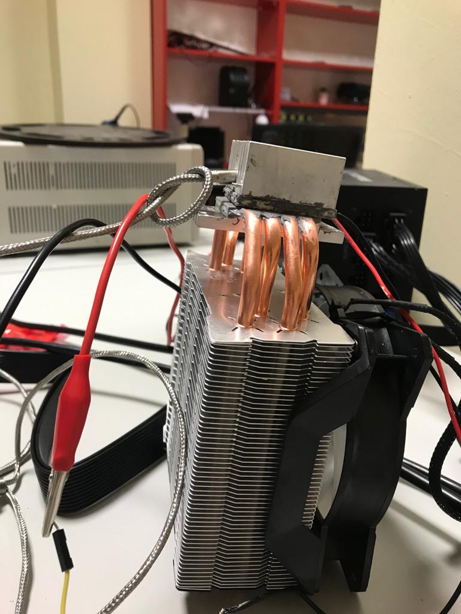
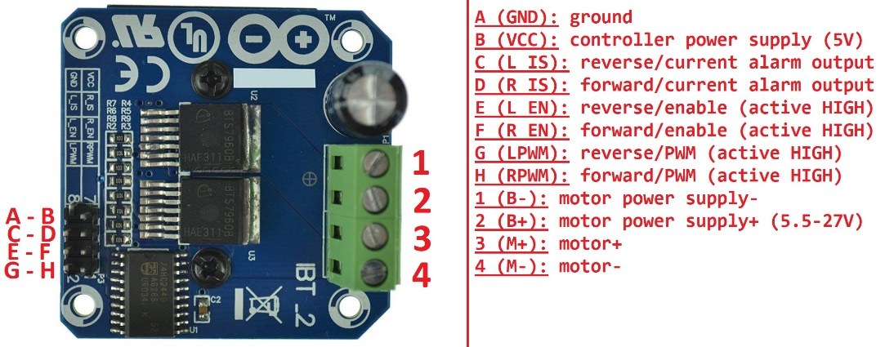

{width="2.7395833333333335in"
height="2.5145833333333334in"}My purpose was that designing high
precision temperature balancing and control system by using RTD
(Resistance Temperature Detector which is also known Pt100), Peltier,
computer fan, CPU cooler and Arduino. RTD which is shown in the *Figure
1* has platin resistor inside of itself. First, I connected a resistor
(330 ohm) as series to measure voltage on RTD's resistor by "analogRead"
on Arduino and then I calculated resistance value of RTD by using
voltage divider and finally transform to temperature by using this
formula:

$$T = \frac{\frac{R_{x}}{R_{0}} - 1}{\alpha}$$

{width="3.4791666666666665in"
height="2.678472222222222in"}When I examined output of temperature
values, I recognize there is an offset value. So, I calibrated RTD to
find offset value by measuring ice and room temperature by comparing
with a temperature sensor (thermocouple probe with adaptor). Offset
value was equal to 5.85 degree. So, I added offset value to formula as:

$$T = \frac{\frac{R_{x}}{R_{0}} - 1}{\alpha} - 5.85$$

Peltier which is shown in the *Figure 2* is used for heat sink; it has 2
sides, while one side is getting hot, other side is getting cold. If we
wanted to cool down excessively, we should get Peltier's hot side to
cold. Otherwise, Peltier would burn.

{width="2.661111111111111in"
height="3.220138888888889in"}So, I used computer fan to get Peltier's
hot side for cooling. Finally, I designed the system as in the *Figure
3*.

{width="6.552083333333333in"
height="2.9180555555555556in"}I needed a driver to control which
condition I want to Peltier on and off. I used BTS7960 which is a motor
driver that control system by receiving PWM signals and making some
functions to component that we can used i.e., h bridge function. I used
BTS7960 to get analog output from digital input of Arduino and control
giving power to Peltier while comparing process temperature and setpoint
on software and wiring battery +/- to power supply and motor +/- to
Peltier. I provided wiring connections between driver and Arduino
according to *Figure 4*.

There were noises on plot and not stable. I applied Kalman filter to
reduce noise on plot and to make more stable. I used samples array as 10
dimensions, and my purpose was receiving 10 samples and calculate median
of these samples and to give median as output. I burned Peltier because
of overloading power while receiving data with high frequency and heat
sink side became very hot and burned suddenly. There were 2 assumptions
the reason why Peltier burned: I didn't change delay which was 20
milliseconds and this causes higher frequency or other assumption that
in test process, I gave energy and take energy many times. It may lead
Peltier to burn.
